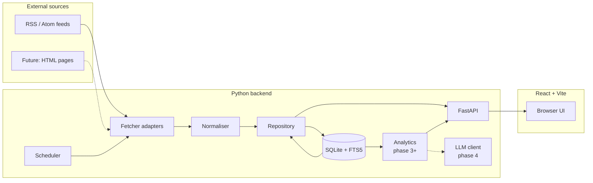

# Architecture

This document describes how `ProjectPressroom` is put together, why each piece is shaped the way it is, and where the seams are for the planned later phases (analytics, summarisation, optional scraping). It is intentionally written before most of the code exists — treat it as a design contract that the implementation should follow, and update it when the design moves.

---

## 1. Guiding principles

In rough order of how often they're invoked:

1. **Boring tech.** Standard, widely-used libraries; stdlib where it suffices. Each dependency must earn its place.
2. **Clear seams.** Fetching, normalising, storing, scheduling, and serving are separate modules behind small interfaces. New fetchers and new analytics modules should plug in without touching unrelated code.
3. **Local-first.** Everything runs on one machine against a single SQLite file. No background services beyond what the user starts. No network surface beyond `localhost` unless explicitly configured.
4. **Typed and documented.** Public functions have type hints and docstrings. Pydantic models are the lingua franca between modules.
5. **Idempotent ingestion.** Re-fetching the same feed must never produce duplicates and must never lose data already stored.
6. **Schema you can grow into.** The header/body split, language column, and tags scaffolding exist from day one even though only some of them are populated in v0.1.

---

## 2. System overview



Solid arrows are v0.1. Dotted ones are planned.

---

## 3. Component breakdown

### 3.1 Fetcher adapters (`pressroom.fetchers`)

A fetcher takes a `Source` and returns a list of `FetchedEntry` objects. Nothing more.

```python
# pressroom/fetchers/base.py
from typing import Protocol

class Fetcher(Protocol):
    async def fetch(self, source: Source) -> FetchResult: ...
```

A `FetchResult` carries either a list of entries plus HTTP metadata (ETag, Last-Modified), or an error with enough context to log usefully. Conditional GETs are used where the server supports them; ETags and `Last-Modified` values from previous successful fetches are stored per source.

Two concrete implementations are planned:

- **`RssFetcher`** (v0.1). Wraps `feedparser`, retries with `tenacity`, applies the source's User-Agent and timeout, parses both RSS 2.0 and Atom transparently (feedparser already does this).
- **`HtmlScraperFetcher`** (later, phase 5). Stub interface only in v0.1. The contract is the same as `RssFetcher`; the implementation would use `httpx` + `trafilatura` to extract article content from a listing page.

The fetcher never touches the database. It returns data; the orchestrator decides what to do with it.

### 3.2 Normaliser (`pressroom.normalize`)

Pure-function module. Takes a `FetchedEntry` and a `Source`, returns an `Article` ready for the repository.

Responsibilities:

- Resolve a stable `external_id`: prefer the feed's `<guid>` / `<id>`, fall back to the canonical URL, finally fall back to a SHA-256 of `(url + title)`. Stored alongside the article so deduplication works without re-deriving.
- Split content into `title` (header), `summary` (the feed's short description, if any), and `body_html` / `body_text` (the full article body, if the feed provides it; some feeds only ship a summary). Keep them in distinct columns — this is what makes header-vs-body analytics possible later.
- Strip dangerous HTML before storing (`bleach` or a small allowlist; we don't render this raw in the frontend but it's still good hygiene). The original raw HTML is also kept in `body_html_raw` for debugging.
- Detect language opportunistically with `langdetect` (added in phase 2; until then `Source.language` is used).
- Parse dates with `feedparser`'s built-in tuple, falling back to `dateutil.parser` for stragglers.

### 3.3 Repository (`pressroom.db.repository`)

The only module allowed to touch SQLite. Thin wrapper around the stdlib `sqlite3` module, exposing a small set of typed methods:

```python
class Repository:
    def upsert_source(self, source: Source) -> int: ...
    def list_active_sources(self) -> list[Source]: ...
    def insert_article(self, article: Article) -> InsertResult: ...
    def article_exists(self, source_id: int, external_id: str) -> bool: ...
    def search_articles(self, query: SearchQuery) -> list[Article]: ...
    def log_fetch_run(self, run: FetchRun) -> None: ...
```

`insert_article` returns whether the row was new or already present. The dedup check is a unique constraint at the DB level — the repository wraps the `IntegrityError` and returns `InsertResult.DUPLICATE` rather than crashing.

Why not an ORM? For a single-file SQLite database with a fixed schema and a single writer, SQLAlchemy is overkill. Hand-rolled SQL behind a repository keeps things visible, fast, and dependency-light. If the project ever grows multi-database support, revisit.

### 3.4 Scheduler (`pressroom.scheduler`)

`APScheduler` with the in-process `BlockingScheduler` for `pressroom daemon`, and the `AsyncIOScheduler` for use inside the FastAPI process if we ever want to co-host. In v0.1 they're separate processes; only one of them runs at a time to avoid two writers.

Each `Source` has a `fetch_interval_minutes`. The scheduler registers one job per active source. Jobs are coalesced (if the daemon was down, missed fires don't pile up) and have a per-source lock so a slow feed can't trigger a second fetch while the first is still running.

The scheduler delegates the actual work to a `FetchOrchestrator`, which is the only place where fetcher + normaliser + repository meet:

```python
class FetchOrchestrator:
    async def run_once(self, source: Source) -> FetchRun: ...
```

### 3.5 API (`pressroom.api`)

FastAPI app with a small, deliberate surface. v0.1 endpoints:

| Method | Path                              | Purpose                                   |
| ------ | --------------------------------- | ----------------------------------------- |
| GET    | `/api/sources`                    | List sources with last-fetch state        |
| POST   | `/api/sources`                    | Add a source                              |
| PATCH  | `/api/sources/{id}`               | Enable / disable / change interval        |
| POST   | `/api/sources/{id}/fetch`         | Manually trigger a fetch                  |
| GET    | `/api/articles`                   | Paginated list, with filters              |
| GET    | `/api/articles/{id}`              | Single article                            |
| GET    | `/api/articles/search?q=...`      | Full-text search via FTS5                 |
| GET    | `/api/runs`                       | Recent fetch-run log                      |
| GET    | `/api/health`                     | Basic liveness                            |

All request and response bodies are Pydantic models. Errors are returned as `{detail: str}` with appropriate HTTP codes. CORS is configured to allow only the Vite dev origin in development; in any deployed mode the frontend is served as static assets from the same origin and CORS is closed.

### 3.6 Frontend (`frontend/`)

React + Vite + TypeScript + Recharts, mirroring the ledger project. Pages for v0.1:

- **Inbox** — paginated, filterable list of articles. Source, date range, language.
- **Article** — full view of one article (title, byline, source, body).
- **Search** — FTS-backed search with hit highlighting.
- **Sources** — list, enable/disable, manually trigger a fetch, see last-run status.

Recharts is only used meaningfully from phase 3 onwards (analytics dashboard). It's pulled in early to lock in the dependency choice.

A thin, typed API client wraps `fetch` calls — one function per endpoint, returning Pydantic-shaped types declared in TypeScript via hand-written interfaces. (Generating these from the FastAPI OpenAPI spec via `openapi-typescript` is a worthwhile improvement once the API stabilises.)

---

## 4. Data flow

A single fetch run, step by step:

1. **Scheduler** fires for source `S`.
2. **Orchestrator** acquires an in-process lock for `S`. Skips if locked.
3. **Orchestrator** asks the **Repository** for `S`'s last ETag / Last-Modified.
4. **RssFetcher** issues a conditional GET via `httpx`. On 304, the run finishes with `articles_new = 0` and we log it.
5. On 200, `feedparser` parses the response into entries.
6. For each entry, **Normaliser** produces an `Article` candidate.
7. **Repository** attempts `insert_article`. The unique constraint on `(source_id, external_id)` enforces dedup.
8. **Orchestrator** records counts (`articles_seen`, `articles_new`, `articles_duplicate`) and any errors into `fetch_runs`.
9. ETag and `Last-Modified` are stored back onto `Source`.

Nothing in this flow is interactive; it can run unattended. The web UI reads from the same SQLite file via the repository.

---

## 5. Database schema

The DDL lives in `src/pressroom/db/schema.sql` and is reproduced here for orientation. The numbered migration system in `db/migrations/` is what's used in practice; `schema.sql` is the current snapshot.

```sql
-- Sources we pull from.
CREATE TABLE sources (
    id                     INTEGER PRIMARY KEY AUTOINCREMENT,
    name                   TEXT    NOT NULL UNIQUE,
    feed_url               TEXT    NOT NULL UNIQUE,
    feed_type              TEXT    NOT NULL DEFAULT 'rss'
                                     CHECK (feed_type IN ('rss', 'atom', 'scraped')),
    homepage_url           TEXT,
    category               TEXT,                           -- 'tech', 'gaming', 'general', ...
    language               TEXT,                           -- BCP-47, e.g. 'en', 'de', 'nl'
    is_active              INTEGER NOT NULL DEFAULT 1,
    fetch_interval_minutes INTEGER NOT NULL DEFAULT 60
                                     CHECK (fetch_interval_minutes >= 5),
    last_etag              TEXT,
    last_modified          TEXT,
    last_fetched_at        TEXT,                           -- ISO 8601 UTC
    last_status            TEXT,                           -- 'ok' | 'error' | 'not_modified'
    last_error             TEXT,
    created_at             TEXT    NOT NULL DEFAULT (datetime('now')),
    updated_at             TEXT    NOT NULL DEFAULT (datetime('now'))
);

-- Articles. The header/summary/body split is intentional and load-bearing.
CREATE TABLE articles (
    id              INTEGER PRIMARY KEY AUTOINCREMENT,
    source_id       INTEGER NOT NULL REFERENCES sources(id) ON DELETE CASCADE,
    external_id     TEXT    NOT NULL,            -- feed guid / atom id / url-hash
    url             TEXT    NOT NULL,            -- canonical link
    title           TEXT    NOT NULL,            -- header
    summary         TEXT,                        -- feed-provided short description
    body_html       TEXT,                        -- cleaned HTML body
    body_text       TEXT,                        -- plain-text body (derived)
    body_html_raw   TEXT,                        -- pre-clean body, kept for debugging
    author          TEXT,
    language        TEXT,                        -- BCP-47, may be NULL pre-phase-2
    published_at    TEXT,                        -- ISO 8601 UTC, from feed
    fetched_at      TEXT    NOT NULL DEFAULT (datetime('now')),
    content_hash    TEXT    NOT NULL,            -- sha256(url || '\n' || title)
    is_read         INTEGER NOT NULL DEFAULT 0,
    is_starred      INTEGER NOT NULL DEFAULT 0,
    UNIQUE (source_id, external_id)
);

CREATE INDEX idx_articles_source_published    ON articles (source_id, published_at DESC);
CREATE INDEX idx_articles_published           ON articles (published_at DESC);
CREATE INDEX idx_articles_language            ON articles (language);
CREATE UNIQUE INDEX idx_articles_content_hash ON articles (content_hash);

-- Full-text search index. SQLite FTS5 is built into the stdlib.
CREATE VIRTUAL TABLE articles_fts USING fts5 (
    title, summary, body_text,
    content='articles',
    content_rowid='id',
    tokenize='unicode61 remove_diacritics 2'
);

-- Keep FTS in sync via triggers.
CREATE TRIGGER articles_ai AFTER INSERT ON articles BEGIN
    INSERT INTO articles_fts (rowid, title, summary, body_text)
    VALUES (new.id, new.title, new.summary, new.body_text);
END;
CREATE TRIGGER articles_ad AFTER DELETE ON articles BEGIN
    INSERT INTO articles_fts (articles_fts, rowid, title, summary, body_text)
    VALUES ('delete', old.id, old.title, old.summary, old.body_text);
END;
CREATE TRIGGER articles_au AFTER UPDATE ON articles BEGIN
    INSERT INTO articles_fts (articles_fts, rowid, title, summary, body_text)
    VALUES ('delete', old.id, old.title, old.summary, old.body_text);
    INSERT INTO articles_fts (rowid, title, summary, body_text)
    VALUES (new.id, new.title, new.summary, new.body_text);
END;

-- One row per scheduled or manual fetch attempt.
CREATE TABLE fetch_runs (
    id                  INTEGER PRIMARY KEY AUTOINCREMENT,
    source_id           INTEGER NOT NULL REFERENCES sources(id) ON DELETE CASCADE,
    triggered_by        TEXT    NOT NULL CHECK (triggered_by IN ('scheduler', 'manual', 'cli')),
    started_at          TEXT    NOT NULL DEFAULT (datetime('now')),
    finished_at         TEXT,
    status              TEXT    NOT NULL DEFAULT 'running'
                                  CHECK (status IN ('running', 'ok', 'error', 'not_modified')),
    http_status         INTEGER,
    articles_seen       INTEGER NOT NULL DEFAULT 0,
    articles_new        INTEGER NOT NULL DEFAULT 0,
    articles_duplicate  INTEGER NOT NULL DEFAULT 0,
    error_message       TEXT
);

CREATE INDEX idx_fetch_runs_source_started ON fetch_runs (source_id, started_at DESC);

-- Reserved for phase 3+; no triggers, no constraints beyond the PK yet.
CREATE TABLE tags (
    article_id  INTEGER NOT NULL REFERENCES articles(id) ON DELETE CASCADE,
    tag         TEXT    NOT NULL,
    score       REAL,                         -- e.g. keyword salience, sentiment magnitude
    source      TEXT    NOT NULL,             -- 'keyword' | 'sentiment' | 'llm' | ...
    created_at  TEXT    NOT NULL DEFAULT (datetime('now')),
    PRIMARY KEY (article_id, tag, source)
);
```

Notes on choices:

- **Two body columns (`body_html` + `body_text`).** Keeping both means analytics can run against plain text without HTML noise, while the UI still has rich content to display. `body_html_raw` is the unaltered original, useful for debugging the cleaning pipeline.
- **`content_hash` is unique globally.** This catches the case where two sources syndicate the same wire story; the second insertion fails fast and the run-log records it as a duplicate.
- **FTS5 with `unicode61`.** Handles diacritics in German and Dutch correctly. The tokenizer is fixed in the DDL because changing it later forces a rebuild.
- **All timestamps as ISO 8601 text.** SQLite's date functions work on text. The added storage cost is negligible and the values are human-readable in any SQLite viewer.

---

## 6. Configuration

Three layers, top to bottom:

1. **`config/sources.toml`** — the curated list of feeds. Versioned in git. Edited by hand.
2. **`.env` / environment variables** — runtime parameters (paths, timeouts, log level). Not committed.
3. **CLI flags** — overrides for a single invocation.

`pydantic-settings` reads (2) and (3) into a single `Settings` object. (1) is loaded separately by the `sources sync` command and written into the `sources` table; once a source is in the DB, the TOML is no longer the runtime source of truth — the DB is. Re-running `sources sync` reconciles: rows whose `feed_url` matches a TOML entry get updated; rows not in the TOML are left alone unless `--prune` is passed.

---

## 7. Scheduling

`APScheduler` with one job per active source, configured at daemon startup:

```python
scheduler.add_job(
    orchestrator.run_once,
    trigger="interval",
    minutes=source.fetch_interval_minutes,
    args=[source],
    id=f"source-{source.id}",
    coalesce=True,
    max_instances=1,
    jitter=30,            # spread fetches across the minute
)
```

`coalesce=True` collapses missed fires (e.g. machine asleep) into one. `max_instances=1` per source means slow feeds won't pile up. `jitter` keeps a bulk reload from synchronising all sources to the same wall-clock second.

The daemon also registers a SIGINT / SIGTERM handler that lets in-flight fetches finish before shutting down.

For Windows users who prefer the OS scheduler: `pressroom fetch --all` is a single-shot CLI that does what one tick of the daemon does. Pointing Windows Task Scheduler at it on a 30-minute trigger is a fully valid deployment mode.

---

## 8. Error handling and retries

- HTTP-level errors are wrapped in `tenacity` retry with exponential backoff (1 s, 2 s, 4 s, give up). Retries apply to 5xx, connection errors, and timeouts — not to 4xx.
- Parse errors from `feedparser` are logged but don't crash the run; the offending entry is skipped and the rest of the feed is processed.
- Database errors propagate. A failed insert rolls back its own transaction; the run is marked `error` with the message.
- Every run ends with a row in `fetch_runs`, success or failure. This is what the UI's "Sources" page shows.

---

## 9. Security

The threat model in v0.1 is small: one user, one machine, loopback only. The relevant concerns are still worth naming:

- **SQL injection.** Mitigated structurally — parameterised queries only, no string-concatenated SQL anywhere.
- **HTML injection.** Article bodies arrive as HTML from third parties. They are sanitised before storage (allowlisted tags / attributes) and the frontend additionally renders untrusted HTML inside a sandboxed component that disables script execution. Never `dangerouslySetInnerHTML` without going through the sanitiser.
- **SSRF.** The fetcher only requests URLs that are present in the `sources` table, which the user populates. There's no user-supplied URL fetched at request time.
- **Secrets.** None in v0.1. When the LLM phase adds an API key, it loads from `.env` only, is never logged, and never appears in API responses.
- **CORS.** Locked down to the configured frontend origin. The API binds to `127.0.0.1` by default; binding elsewhere requires an explicit env var, which would also be the moment to add an auth layer.

The architecture deliberately does *not* try to be hardened for multi-user or internet-exposed deployment. If that ever becomes a goal, several things change: authentication on the API, rate limiting, secrets in a proper vault, content security policy on the frontend, and a real review of the HTML sanitiser.

---

## 10. Logging and observability

- Standard `logging` module, configured once at startup. Structured key-value lines in development; JSON in any non-interactive mode (the daemon).
- Every fetch run produces a `fetch_runs` row — that's the user-visible audit log.
- The `runs` API endpoint exposes the last *n* runs so the UI can show a "last fetch: 8 minutes ago, 3 new articles" indicator per source.
- No metrics export (Prometheus etc.) in v0.1. Easy to add behind a feature flag if needed later.

---

## 11. Extension points

Where future work plugs in without disturbing v0.1 code:

- **New fetchers.** Implement the `Fetcher` protocol, register in a small `FETCHERS` dict in `fetchers/__init__.py`, choose one per source via `feed_type`. The HTML scraper goes here.
- **Analytics modules.** Read-only on `articles`, write into `tags` (and possibly a future `analytics_runs` table). Run as scheduled jobs in the daemon or on demand via a new CLI subcommand. The frontend reads aggregated views via new API endpoints.
- **LLM summarisation.** A `Summariser` module wraps the chosen API. It writes summaries into a new `summaries` table (one-to-one or one-to-many with `articles`) and into a `digests` table for newsletters. The API key lives in `.env`. Cost is tracked per call to `llm_calls` so a weekly digest doesn't quietly burn through credit.
- **Newsletter.** A dedicated `newsletter` module renders an HTML / Markdown digest from the last seven days' summaries plus analytics. Delivery is out of scope at first — write to file is fine; SMTP later.

---

## 12. Testing strategy

Aimed at "enough to catch real regressions without becoming the project." See `FEATURES.md` for the gentle ramp-up plan.

**Unit tests (target ~80% coverage of `normalize.py` and `repository.py`):**

- Normalisation of representative RSS and Atom payloads (real fixtures saved from gamestar, Ars Technica, Heise).
- `external_id` fallback chain.
- HTML sanitisation: known-bad inputs in, known-safe outputs out.

**Integration tests:**

- End-to-end fetch using `httpx`'s `MockTransport` to serve a fixture feed; assert the right rows appear in a temporary SQLite file.
- A second run against the same fixture must produce zero new articles.

**API tests:**

- FastAPI's `TestClient` over each route. Happy-path plus one error per route.

**Not tested in v0.1:**

- The scheduler itself. APScheduler is well-trusted upstream; testing it adds little.
- The frontend. A handful of component tests with `vitest` go on the v0.2 list once the UI stabilises.

---

## 13. Deployment model

v0.1 is a desktop application disguised as a small server:

- Run `pressroom daemon` (or a Task Scheduler entry) in the background.
- Open the frontend in a browser, pointed at `http://localhost:5173` (dev) or `http://localhost:8000` (when the API serves the built frontend statically — phase 2 will set this up).
- The SQLite file lives under `./data/` and is the only piece of state worth backing up.

Containerisation (`Dockerfile` + `docker-compose.yml`) is a nice-to-have, not a requirement, and would mostly be useful if you decide later to run this on a small NAS or VPS.

---

## 14. Decision log

| Decision                                          | Reason                                                                                                                     |
| ------------------------------------------------- | -------------------------------------------------------------------------------------------------------------------------- |
| Hand-rolled SQL + repository over an ORM          | Single-file SQLite, fixed schema, single writer. ORM adds weight without benefit at this scale.                            |
| `feedparser` over rolling our own RSS / Atom logic | Handles every edge case in 20 years of malformed feeds. Stdlib XML libraries would re-invent the wheel badly.              |
| `httpx` over `requests`                            | Equivalent ergonomics, modern internals, real async support for when concurrency matters. Maintained.                      |
| FTS5 over Whoosh, Elasticsearch, Tantivy, ...     | Built into SQLite. Zero extra processes. More than enough for a personal corpus of tens of thousands of articles.          |
| APScheduler over `cron` / Task Scheduler only     | Cross-platform, in-process, lets the daemon be self-contained. Task Scheduler still works as an alternative trigger.       |
| TOML for the curated source list                  | Comfortable to hand-edit, tracked in git, native in Python 3.11+ via `tomllib`. JSON would also work; TOML wins on ergonomics. |
| React + Vite + Recharts                           | Already in use for the ledger project; reusing the stack means less context-switching and shared tooling habits.           |
| Pydantic models as the inter-module type          | Same shape on the wire, in the DB layer, and in tests. Validation comes for free.                                          |

This table grows as new decisions get made. Reversed decisions get a strike-through and a one-line reason, not a delete.
